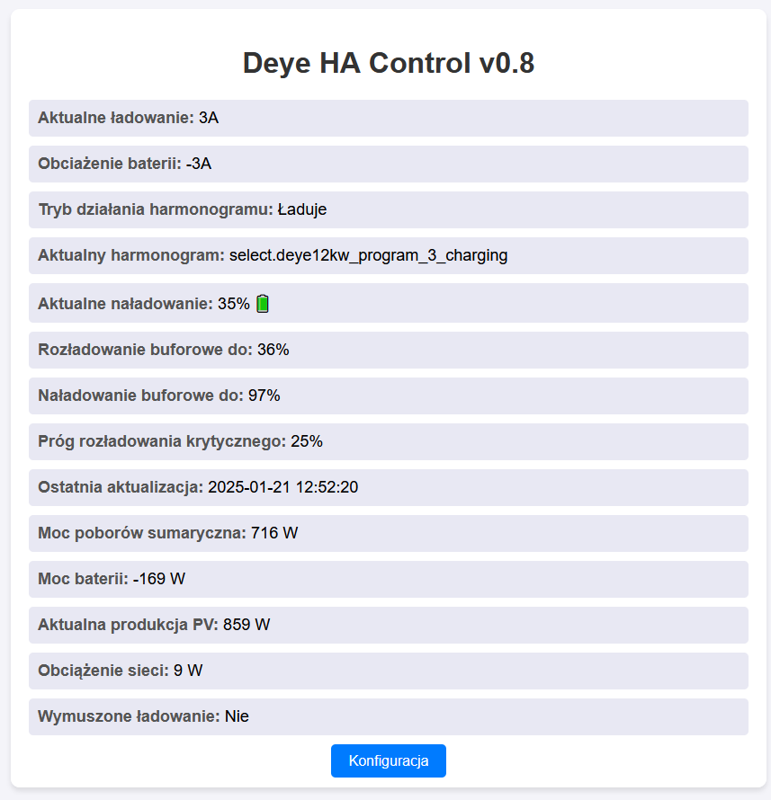

Dostępna jest również wersja pod Node-Red (kod do importu jest w katalogu /node-red , wymagająca Home Assistant + Node Red
W wersji Node Red mamy przycisk start o stop którym uruchamiamy automatyzację.
Mamy też kilka globalnych zmiennch które musimy wyedytować pod siebie.
Należy zmienić też nazwy encji pod swoje i wybrać serwer home assistenta w miejscach gdzie jest to potrzebne.

Poglądowo opis encji można znaleźć w setup.cfg

Wersja dla Node-Red działa niezależnie od skryptu bash, jak i również wersja bash nie wymaga node-red.


Ten skrypt ma na celu regulować moc ładowania i rozładowana magazynu w celu ograniczenia oddawania energii do sieci.
Celem jego jest ograniczenie oddawania energii do sieci do minimum.
Jest to ulepszenie działania trybu AC Couple on Grid side/load.

UWAGA: Twój harmonogram pracy w Deye zostanie zmieniony. Godziny nie zmienią się, zmieni się tryb grid charge i jego moc.

Wymagane jest ustawienie grid charge w ustawieniach Deye.
switch.deye12kw_battery_grid_charging na włączone + ustawić number.deye12kw_battery_grid_charging_current na 0A
z poziomu Home Assistant/Ustawienia/Solarman/ urządzenie

Nie ma znaczenia ile i jakie mamy inwertery przed lub za Deye.

Skrypt nie będzie zapewne przydatny dla osób które posiadają tylko sam falownik Deye. Deye sam potrafi w oparciu
o swoje harmonogramy i algorytmy robić to samo jednak praca w trybie Couple to inna sprawa i tu już nie działa
to tak jak oczekiwałem.

Na tą chwilę skrypt działa opierając się na procentach naładowania magazynu.
Mocy produkcji i sumy mocy poborów.

Jak to działa ?

Ustalamy progi dolnego rozładowania i górnego naładowania magazynu. Skrypt pobiera dane o produkcji i konsumpcji i wzorując się na wyniku
ustala moc ładowania magazynu lub pozwala go rozładowywać. W uproszczeniu skrypt reguluje moc GRID CHARGE w Deye celem wykożystania maksymalnie
całej produkcji PV z wszystkich źródeł. Gdy produkcja jest zbyt mała a naładowanie magazynu pozwala na pobory, wówczas automatycznie zmienia
się profil harmonogramu i magazyn wspomaga pobory.

Q: Czemu jest to lepsze niż zwykły harmonogram ?
A: Zwykłych harmonogramów możemy mieć 6 i nie są one zawsze optymalne pod panujące warunki. Tu ilość harmonogramów nas nie ogranicza bo są generowane dynamicznie w zależności
od sytuacji.

Dodatkowo możemy ustalić stan naładowania krytycznego, gdy magazyn znajdzie się poniżej tej wartości (np. w skutek braku zasilania sieciowego)
zostanie uruchomione ładowanie magazynu wymuszone aż do momentu gdy osiągnie on procent ustalonego dolnego naładowania.

Do działania potrzebujemy Home Assistant wraz z obsługą Deye https://github.com/davidrapan/ha-solarman

Potrzebujemy opomiarowaną produkcję PV, opomiarowanie odczytywane z opuźnieniem np. z chmury, nie sprawdzi sie.
Odczyt musi być w czasie rzeczywistym.
Zalecam podlicznik Zamela lub Shelly ktore podają dane w czasie rzeczywistym.

Kolejnym wymaganiem jest opomiarowanie poborów przed Deye, tzw. non essential, zwykle są to urządzenia wysokiej mocy jak ładowarka EV czy pompa ciepła.
Cel jest taki żeby mieć wartość wszystkich poborów w jednej encji, tj. LOAD (odczyt z Deye) + Non essential (Odczyt z podlicznika)
+ Straty (Odczyt z Deye)

Odczyt (deye external power + ups power) nie będzie działał, moce tu sa zalezne od trybow pracy i baterii co wyklucza
poprawne działanie.


Przykład (configuration.yaml):
```
    - name: "Shelly Allside Power Total"
      unique_id: shelly_allside_power_total
      state: >-
        
        
        
        {{ ups_power + gridside_power + power_losses }}
      unit_of_measurement: W
      device_class: power
      state_class: measurement
```

Tak podana encja będzie zwracać nam wartość faktyczną poborów przed i za Deye dzięki temu porównamy tą moc 
z encją produkcji PV i na jej podstawie podejmniemy decyzję o trybie pracy w Deye.


Dodatkowo mamy możliwość ustalenia maksymalnej mocy ładowania magazynu. Ta wartość nie zignoruje ustawien BMS/magazynu w deye.

Q: Jaki ma to sens gdy mój magazyn i tak nie zmieści całej produkcji ?
A: Przyjmijmy taki scenariusz:
godzina 
9.30 jest nadprodukcja, ładujemy magazyn
10.20 zmienia się pogoda i nie ma wystarczającej produkcji, magazyn oddaje energię.
10.40 mamy nadprodukcję, ładujemy magazyn
11.05 brak wystarczającej produkcji, dobieramy z magazynu.
11.30 nadprodukcja, ładujemy magazyn
12.10 brak wystarczającej produkcji, dobieramy z magazynu.
itd.
Całośc dzieje się automatycznie w założonych ramach naładowania magazynu.

Q: Prosument ma przecież bilansowanie godzinowe.
A: Tak ale tylko godzinowe, a dzięki temu skryptowi czas bilansowania jest ograniczony tylko pojemnością magazynu.


Uruchomienie:

Wgrywamy na serwerek linuxowy do jakiegoś katalogu gdzie najlepiej mamy dostęp przez przeglądarkę. ustawiamy setup.cfg pod siebie. uruchamiamy go.sh
Możemy mieć podgląd/konfigurację poprzez web (zalecam pierwszą konfigurację z poziomu shella).



